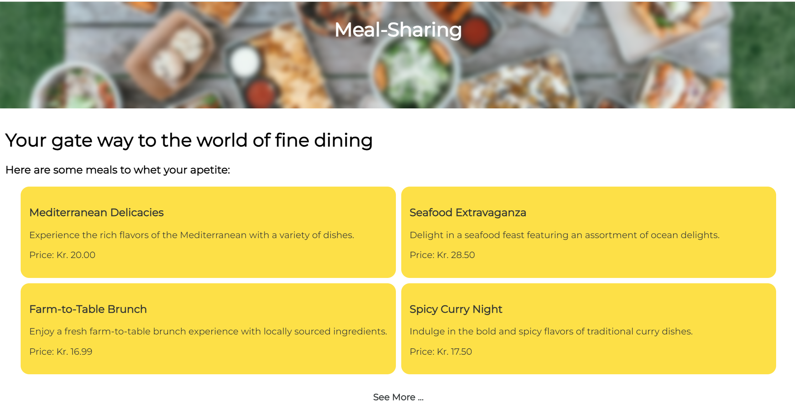
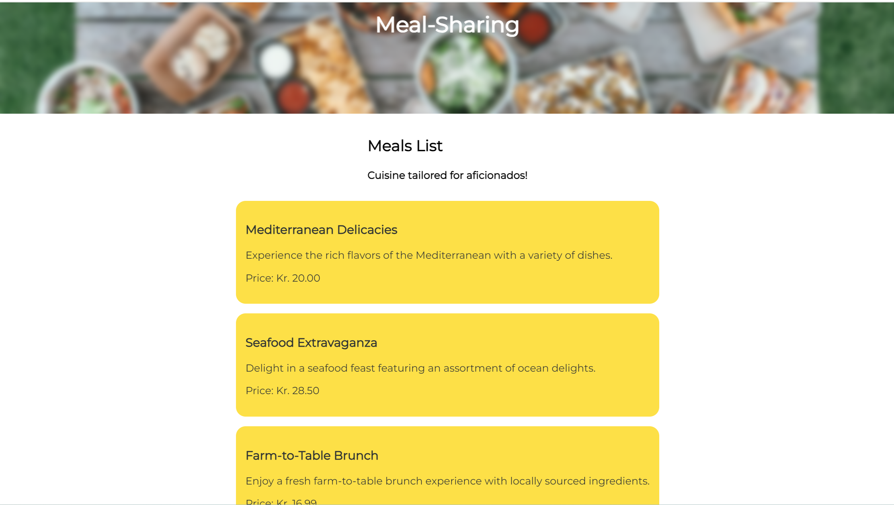
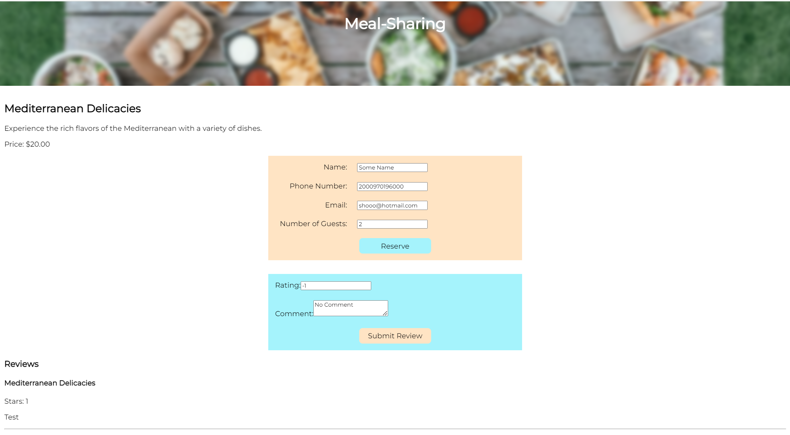

# Meal Sharing App
➡️ <a href="https://meal-sharing-2.onrender.com/meals" target="_blank">**LINK TO THE APP**</a>

Deployed on render.com, this app Utilizes Node for backend, React for front-end interactivity, React Router for seamless navigation, and RESTful APIs for data retrieval. This full-stack meal reservation and review application seamlessly integrates user-friendly interfaces with efficient backend operations.

## Technologies Used

-   Express.js
-   KnexJS
-   PostgreSQL
-   React
-   CSS Modules

## What I Learned

I learned to deploy a fullstack app and the many considerations for it. The app was using MySql for database, which I had to convert to Postgres. 

The biggest challenge was finding workarounds for errors to do with file system resources and port usage due to config files (in Windows, they use \ rather than /. Solution was ./, which means relative path starting from the current active folder).

Then there was the logic of getting data using ternary operator. Equally important was mastery of CSS as I wanted to render the review and reservation forms using CSS and not a JS event listener. I am going to find a better solution for that.

I also learned that I should manage my time better, define the design clearly and create mokeups to visualise the app. For this app my objective was to make it work and to deploy it but I have already planned what I need to learn more of. 

## Screen shots

